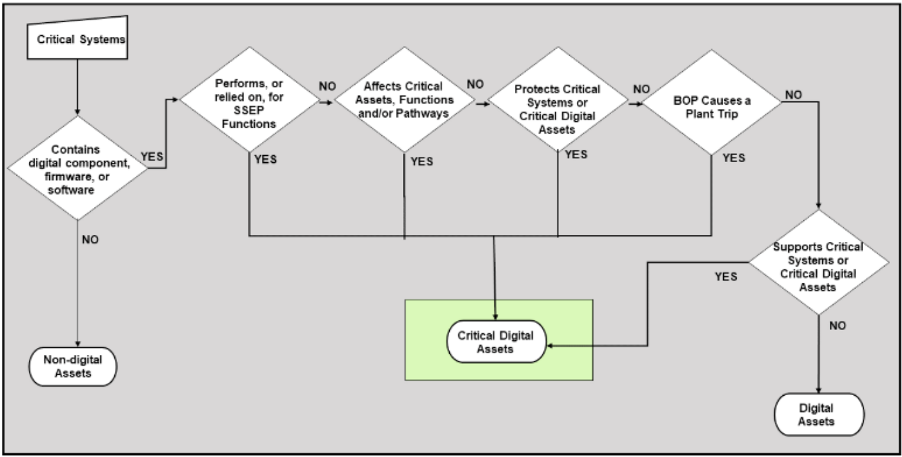

# Critical Digital Asset Determination

Critical Digital Asset (CDA) determination is based on consequence. A device does not become a CDA just because it has a known vulnerability. It becomes a CDA when compromising that device could negatively affect Safety, Security, Emergency Preparedness (SSEP), or a system that supports one of those functions.

## SSEP Functions

SSEP stands for Safety, Security, and Emergency Preparedness.

### Safety

Safety functions help protect the plant from conditions that could lead to a radiological release.

Examples include digital systems that:

- Support reactor protection or engineered safety features
- Monitor or control safety-related equipment

### Security

Security functions help protect the facility from intentional adversary actions.

Examples include digital systems that:

- Support detection, alarm assessment, delay, and response
- Provide surveillance or monitoring
- Support Physical Protection System (PPS) functions

### Emergency Preparedness

Emergency Preparedness functions help protect workers and the public during and after an event.

Examples include digital systems that:

- Support emergency classification
- Coordinate protective actions
- Support emergency communications and response

## CDA Evaluation Criteria

This project used a consequence-based CDA determination process aligned with 10 CFR 73.54, NEI 10-04, and Regulatory Guide 5.71.

The main questions were:

1. Does the asset perform or support an SSEP function?
2. If compromised, could the asset negatively affect an SSEP function?
3. Is the asset a digital component of a critical system?

These questions were not treated as a simple checklist. The final determination depended on the asset's function, location, connectivity, and consequence of compromise. A connection to a critical system can increase concern, but CDA classification still depends on whether compromise of the asset could credibly affect an SSEP function.

## System Assumptions

The evaluated system included two network-connected PPS cameras, a Network Video Recorder (NVR), and a Power-over-Ethernet (PoE) switch.

### Camera 1

- Located in the Owner-Controlled Area (OCA)
- Facing a perimeter area
- Only camera covering that area
- Used for surveillance and alarm assessment

### Camera 2

- Located inside the Protected Area (PA)
- Not facing the PA barrier
- Not assumed to monitor Vital Area boundaries, Target Set equipment, or Critical Interruption Points
- Used for supplemental interior surveillance

## Camera 1: OCA Perimeter Camera

**Camera 1 was determined to be a CDA.**

Camera 1 supports a security function by providing surveillance of the Owner-Controlled Area under the project assumptions. It also supports alarm assessment by giving security personnel real-time and recorded video of activity in that area.

If this camera were disabled, manipulated, or made unavailable, the facility could lose visibility over the area it covers. Because Camera 1 is the only camera assumed to cover that location, its compromise could create a meaningful gap in surveillance and alarm assessment.

### Impact of Compromise

Compromise of Camera 1 could:

- Create a surveillance gap in the OCA
- Reduce the ability to detect unauthorized activity
- Degrade alarm assessment
- Delay security response
- Require compensatory measures, such as additional patrols or alternate surveillance
- Allow an adversary to approach the Protected Area with a lower chance of detection

### CDA Determination

| Question                                | Determination | Reason                                                      |
| --------------------------------------- | ------------- | ----------------------------------------------------------- |
| Performs or supports an SSEP function?  | Yes           | Supports surveillance and alarm assessment                  |
| Could compromise adversely affect SSEP? | Yes           | Loss or manipulation could degrade detection and assessment |
| Digital component of a critical system? | Yes           | Part of the PPS assessment system                           |

## Camera 2: Interior Protected Area Camera

**Camera 2 was not determined to be a CDA under the project assumptions.**

Although Camera 2 is part of the broader video assessment system, its specific role is supplemental interior surveillance. The project assumptions state that it does not monitor the Protected Area barrier, Vital Area boundaries, Target Set equipment, or Critical Interruption Points.

A general-purpose interior camera can improve situational awareness, but that alone does not make it a CDA. The key question is whether losing or manipulating that camera would negatively affect a required SSEP function. Under the assumptions used in this project, Camera 2 does not meet that threshold.

### Impact of Compromise

Compromise of Camera 2 could:

- Reduce interior visibility
- Decrease defense-in-depth
- Remove supplemental recorded footage
- Potentially assist adversary activity inside the PA

However, under the stated assumptions, its compromise would not directly degrade a required SSEP surveillance or assessment function.

### CDA Determination

| Question                                | Determination                 | Reason                                                                            |
| --------------------------------------- | ----------------------------- | --------------------------------------------------------------------------------- |
| Performs or supports an SSEP function?  | No                            | Provides supplemental PA surveillance, not required barrier or target monitoring  |
| Could compromise adversely affect SSEP? | No, under current assumptions | Does not monitor a required security-significant area                             |
| Digital component of a critical system? | Yes                           | Part of the PPS assessment system, but its specific function is not required here |

## Important Caveats

Camera 2 would need to be reconsidered as a CDA if any of the following were true:

- It monitors a Vital Area boundary
- It monitors Target Set equipment
- It monitors a Critical Interruption Point
- It is credited in the documented Protective Strategy
- It is required by the Physical Security Plan
- It supports a license condition or formal regulatory commitment
- Its loss would require compensatory measures

This distinction matters because CDA classification depends on function and consequence, not simply location, device type, or known vulnerabilities.

## Summary

| Asset    | Location                | Function                                            | CDA Status |
| -------- | ----------------------- | --------------------------------------------------- | ---------- |
| Camera 1 | Owner-Controlled Area   | Surveillance and alarm assessment                   | CDA        |
| Camera 2 | Protected Area interior | Supplemental surveillance under current assumptions | Not a CDA  |
