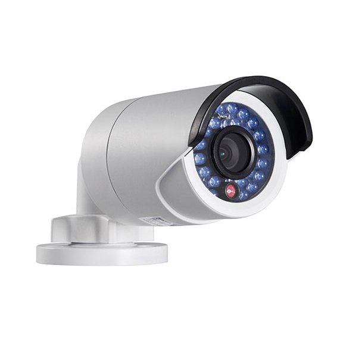
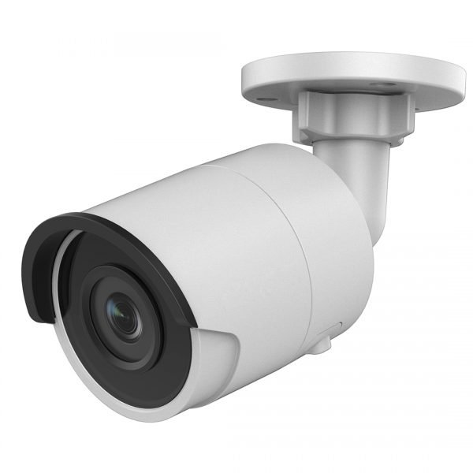
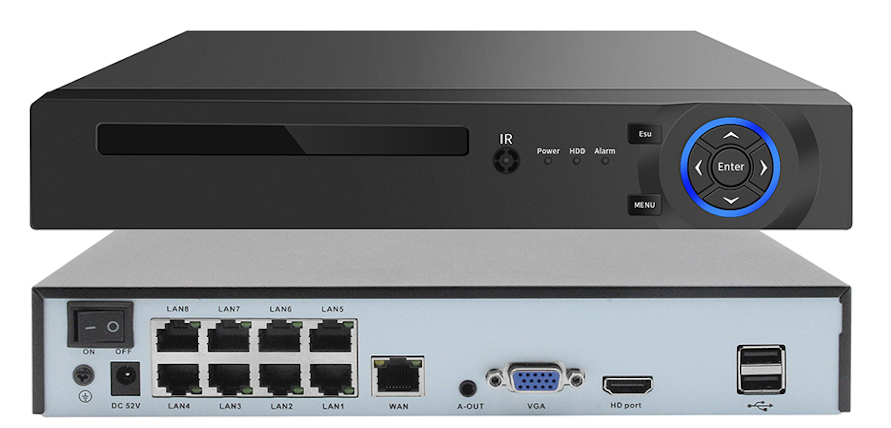
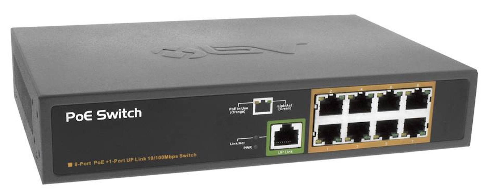
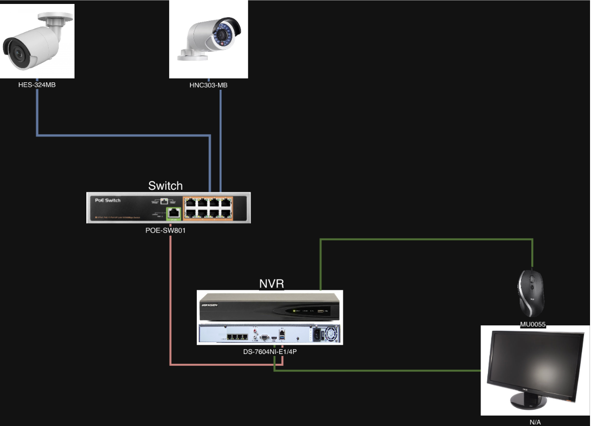

# System Architecture

The evaluated Physical Protection System (PPS) camera environment represented a small security monitoring network in a simulated nuclear facility setting. The system allowed operators to view camera feeds, review recorded footage, and use video to support alarm assessment.

System availability and video integrity mattered because a lost, delayed, or manipulated feed could affect operator judgment and physical security response.

## System Components

The system included three main component groups.

### IP Cameras

<table>
  <tr>
    <td align="center">
      <strong>Camera 1: HNC303-MB</strong> 
      
    </td>
    <td align="center">
      <strong>Camera 2: HES-324-MB</strong> 
      
    </td>
  </tr>
</table>

### Network Video Recorder

### Power-over-Ethernet Switch

## Component Roles

### IP Cameras

The IP cameras produced the video feeds used for monitoring and assessment. Each camera operated on the local network, had its own IP address, and exposed a web management interface for configuration.

The cameras depended on:

- Ethernet connectivity
- Power from the PoE switch
- Communication with the NVR
- Correct video, alarm, and control settings

### Network Video Recorder

The Network Video Recorder (NVR) served as the main viewing and recording point for the camera system. It received video streams from the cameras, stored recordings, and allowed users to view live or recorded footage.

In this setup, the NVR also provided access to system configuration options, including:

- Camera settings
- Recording behavior
- Alarm settings
- Motion detection
- User access controls
- Network parameters

Because the NVR aggregated video data and exposed configuration options, compromise of the NVR could affect both system visibility and the integrity of the camera environment.

### PoE Switch

The Power-over-Ethernet (PoE) switch connected the devices and supplied power to the cameras.

The switch supported communication between:

- Camera 1
- Camera 2
- NVR
- Other devices connected to the same local network

## Baseline Network Layout

The original layout used a flat local network. Both cameras connected to the PoE switch, and the switch connected to the NVR.

In this baseline design, the devices communicated on the same subnet. That made the system simple to connect and manage, but it also created a security weakness. Any device with access to that subnet could potentially reach the cameras or NVR if additional controls were not in place.

## Data Flow

The cameras captured video and sent it to the NVR. The NVR stored recordings and made the feeds available for live viewing, playback, and alarm assessment.

This centralized flow was operationally simple, but it also created dependency risk. If an attacker gained access to the camera/NVR network, they could potentially affect:

- Video availability
- Video integrity
- Camera configuration
- Recording behavior
- Alarm or motion-detection settings
- Operator confidence in the displayed feed

## Security Observations

The baseline architecture created several security concerns:

- Cameras and the NVR were reachable on the same local subnet.
- Web management interfaces were accessible through IP communication.
- Direct device-to-device access increased exposure.
- A compromised endpoint on the subnet could attempt to reach camera or NVR services.
- The NVR was a central dependency for viewing, recording, and configuration.
- Unauthorized configuration changes could affect surveillance and alarm assessment.

## Architecture Risk

The main architectural risk was not only that individual devices had known vulnerabilities. The larger issue was that the flat network made camera and NVR services reachable from the same local network.

An attacker with wired or wireless access to that subnet could potentially interact directly with the cameras or NVR. For a PPS camera supporting security functions, that access could degrade the facility's ability to detect, assess, and respond to unauthorized activity.

## Design Implication

Understanding the baseline architecture was necessary before selecting mitigations. Since the original design allowed direct access between the NVR, cameras, and other same-subnet devices, the mitigation strategy focused on separating the camera side from the NVR/client side and forcing camera traffic through a controlled reverse proxy and firewall.

See [`mitigation-strategy.md`](mitigation-strategy.md) for the segmented architecture and compensating controls.
